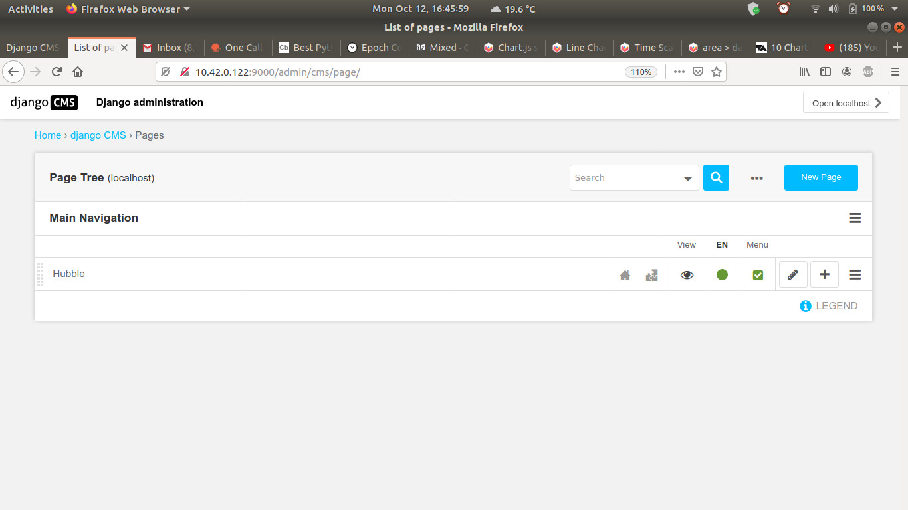
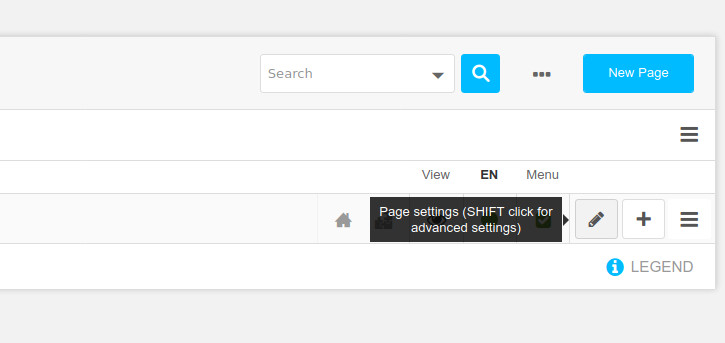
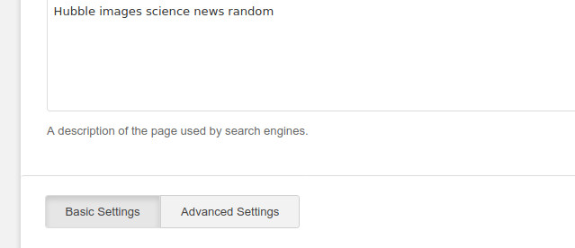
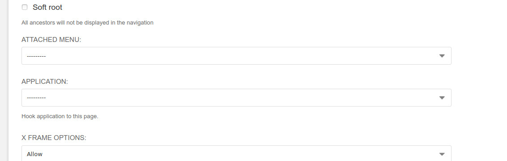
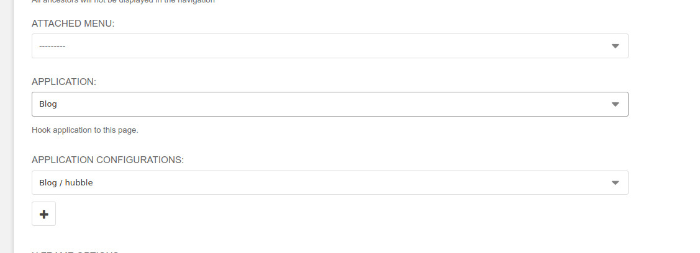
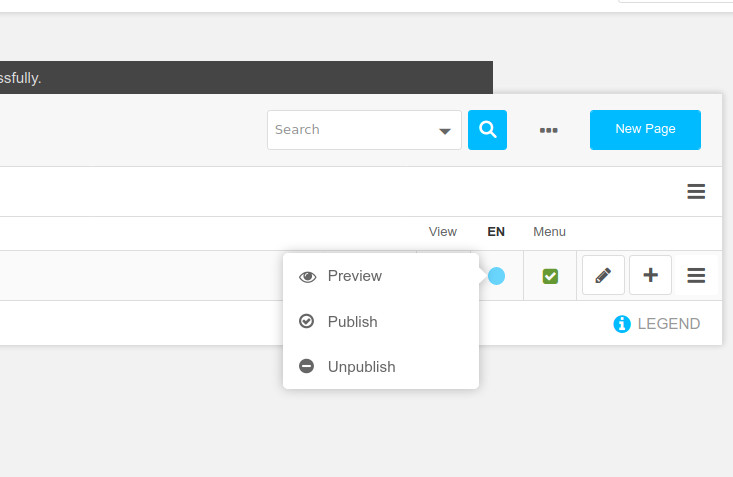
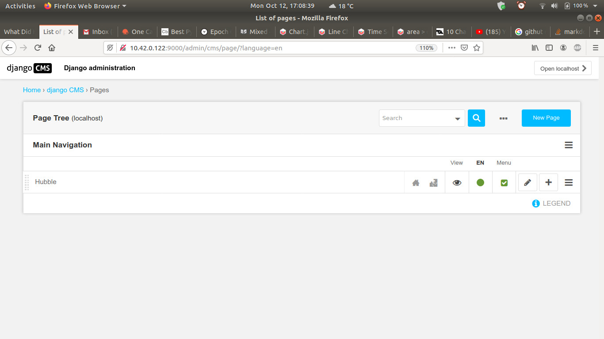

# Django Content Server

[Home](https://github.com/Python-Marketing/django-content-server)

This assumes ubuntu server or desktop.

### Basic understanding needed to get site server running

* Virtual env
* Ubuntu desktop or server
* Git - https://github.com/Python-Marketing/django-content-server
* Django
* Python 3 and pip

Installation
-------------

#### Need some structure in place.

#### For logging : 

`$ mkdir /var/log/DEVELOPMENT`

Give access to the logging : 

`$ chown -r username:username /var/log/DEVELOPMENT`

#### Git directory parent

`$ mkdir /development`

`$ chown -r username:username /development`

`$ cd /development`

#### Git Clone the repository

`$ git clone https://github.com/Python-Marketing/django-content-server.git`

`$ cd /development/django-content-server`

#### Setup virtualenv:

Run this command to create a virtualenv, change the path to anything but /var/tmp

`$ virtualenv -p python3 /var/tmp/venv`

Then we run the following code, in a terminal in the directory `/development/django-content-server` :

`$ source /var/tmp/venv/bin/activate`

To activate the virtual env


### Add your IP address into the `settings.py` file in `site_server` folder

```
ALLOWED_HOSTS = ['192.168.1.3', '10.42.0.1', '10.42.0.122']
```

#### You only need One IP Address in allowed hosts

### OK hard work is done. Lets start installing and migrating the app.

Run the script :

`python3 setup_content_server.py`

#### You will run this script repeatedly until installation process is complete.

Errors will hint at you what ubuntu packages are needed. 

### Usually copy the error and google it. 

### After this we need to configure the new pages created.

Log into the admin section http://127.0.0.1:9000/admin/cms/page/

The username and password are in `setup_content_server.py`



### Find the advanced options





### Find the Application option



### And change it then save the Page



### Publish Changes, hover over the blue dot then click publish



### Green is good



## Ok hard work done

Read through the script its self explanatory. You can adapt it to so almost anything.

### NB - leave runserver off until installation process is complete.

# LAstly

### Run `python manange.py process_search_web_results`

